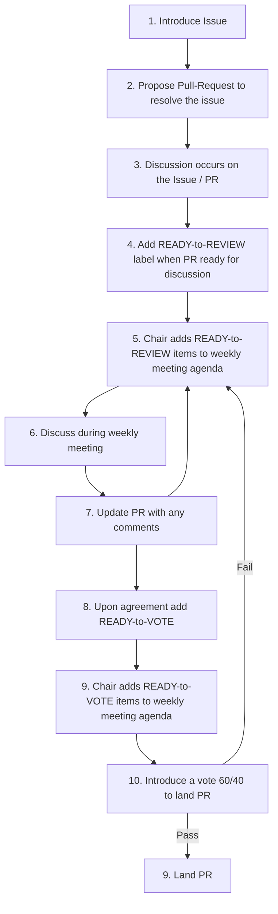

 - **Date**: Oct. 20, 2025
 - **Time**: 7 pm - 8 pm US Eastern Daylight Time ([View Meeting Time in Your Timezone](https://time.is/1200_29_September_2025_in_ET))
 - **Location**: Virtual Meeting.

## **Upcoming meetings**
 - Next: Monday, Oct. 27, 2025 @ 12 pm - 1 pm US Eastern Daylight Time ([View Meeting Time in Your Timezone](https://time.is/1900_06_October_2025_in_ET))

## Agenda
 - Note: The meeting will be recorded to enable transcription for easy meeting notes.
 - Proposed procedure to keep things moving forward.
   - Note, having a process with vote does not preclude **revisiting items and refinement** in the future.
   - Proposed flowchart:

 - **Ready-to-Review PRs**:
   - [QCRes: Definition of a Quantum Computing Resource #14](https://github.com/openQSE/openqse-spec/pull/14)
     - Potential interactions
     - similarities with QRMI/QDMI

## Attendance

|Person                 | Institution           |
|-----------------------|-----------------------|
| Laura Schulz          | ANL                   |
| Amir Shehata          | ORNL                  |
| Thomas Naughton       | ORNL                  |
| Yasuko Eckert         | AMD                   |
| Catalina Albornoz     | Xanadu                |
| Hiroshi Horii         | IBM                   |
| Josh Moles            | IonQ                  |
| Kevin K               | Alice & Bob           |
| Martin Schulz         | TUM                   |
| Neal Erickson         | Quantinuum            |
| Patrick Deuley        | IonQ                  |
| Rick Altherr          | IonQ                  |

## Notes

**Date:** October 20, 2025
---

## 1. Meeting Overview

The meeting focused on two main areas:

1. Establishing a **workflow for managing proposals and discussions** in OpenQSE.
2. Continuing the **definition and discussion of the “Quantum Computing Resource (QCR)”** concept, including its properties, scope, and interaction models.

---

## 2. Proposed Workflow for Discussions and Decisions

### Summary

Amir introduced a **structured workflow** aimed at improving progress tracking and decision-making in OpenQSE.
The process will use **GitHub Issues and Pull Requests (PRs)** to formalize discussions and votes.

### Proposed Workflow Steps

1. **Issue Creation:** Introduce a new topic (e.g., “Define Quantum Computing Resource”).
2. **Pull Request (PR):** Propose a draft definition or change linked to the issue.
3. **Discussion:** Conduct discussions primarily in GitHub, not via direct messages.
4. **Review Stage:** When ready, label the PR as **“Ready to Review.”**
5. **Meeting Discussion:** Discuss labeled PRs during the next scheduled OpenQSE meeting.
6. **Iteration:** Update PRs based on feedback.
7. **Voting:** When consensus is near, label PR as **“Ready to Vote.”**
8. **Voting Outcome:**

   * Passes if **≥60% approval**.
   * If it fails, return to review for clarification and revision.
9. **Landing:** Merge (land) PRs that pass the vote.

### Key Discussion Points

* **Voting Threshold:** Confirmed as 60/40 approval ratio (60% yes votes).
* **Abstentions:** Martin noted the need to clarify how to handle absentee and abstain votes.
* **Process Simplicity:** Kevin raised concerns about the workflow’s complexity; suggested evaluating its effectiveness after a few months.
* **One PR per Issue Rule:** Martin recommended mirroring the MPI Forum practice—one PR per issue—to simplify voting and management.
* **Iteration & Evaluation:** Group agreed to review the workflow after implementation and adjust as needed.
* **Other Remarks:** Suggestion that may want to refine/revise labels for depdenencies, e.g., approved but not ready for merge

### Agreed Actions

* Adopt the workflow provisionally.
* Document absentee/abstain handling rules.
* Review the workflow’s effectiveness in ~2 months.

---

## 3. Definition of “Quantum Computing Resource” (QCR)

### Context

The team revisited the definition of a **Quantum Computing Resource (QCR)** and its scope within OpenQSE.
Discussions centered on whether QCRs should be viewed as **distinct quantum entities** or as **general computational resources** with “quantum” as one attribute.

### Key Themes and Comments

#### A. Conceptual Model

* **Kevin K’s Proposal:**

  * A *resource* is a general compute entity that may have a **“quantum” property**.
  * Emphasized a flexible approach—nodes can be tagged with multiple properties (e.g., quantum, classical, GPU).
  * Advocated for modeling after **SLURM’s resource management** (attribute-based).

* **Amir’s View:**

  * Agreed flexibility is important but suggested maintaining a clear high-level definition to guide interactions.
  * Proposed focusing first on *entity identification* and *interactions* rather than low-level details.

#### B. Abstraction and Composition

* **Patrick Deuley:** Highlighted the need to support “black box” processing nodes—abstract components that may perform proprietary or external computations.
* **Martin Schulz:** Observed that the proposed model could lead to **recursive or hierarchical definitions** of a quantum resource.

  * For example, if a high-level program executes loops that invoke other quantum operations, those inner executions may themselves call lower-level quantum resources.
  * This creates a **nested or cascading structure** of quantum resources.
  * Martin noted that this recursion is not necessarily a problem but should be explicitly defined to avoid confusion about boundaries and control levels.
* **Catalina Albornoz:** Suggested adding a section describing what a QCR *is not* to clarify scope (e.g., not including pre-processing components).

#### C. Integration and Feedback Loops

* **Catalina:** Stressed importance of supporting **classical-quantum feedback loops** (e.g., for variational algorithms).
* **Kevin & Rick Altherr:** Emphasized that **resource reservation** should be distinct from **resource capability** (a resource may support multiple workloads).

#### D. Inputs and Outputs

* **Hiroshi Horii:** Asked what the defined inputs and outputs to a QCR are.

  * Amir suggested focusing on *interaction-level* operations (reserve, submit, retrieve, release, telemetry) rather than implementation details.

#### E. Classical vs. Quantum Resource Definitions

* **Hiroshi and Kevin:** Noted the eventual need for consistent terminology for **Classical Resources**, **Quantum Resources**, and potentially **Storage Resources**.

---

## 4. Next Steps and Action Items

### Agreed Actions

1. **GitHub Updates:**

   * Ensure all members have access to the repository (Thomas to resolve access issues for Kevin, Martin, others).
2. **Discussion Continuation:**

   * Everyone to **comment directly on the current PR** defining the QCR by next meeting.
   * Add specific objections, suggestions, and examples.
3. **Review and Iterate:**

   * Revisit the QCR definition in the next meeting, incorporating feedback.
   * Examine the **sequence diagram** Amir created (based on QDMI and QRMI specs from LRZ and IBM).
4. **Concrete Examples:**

   * Martin requested mapping abstract QCR concepts to **specific real systems** to clarify interpretation.

### Tentative Agenda for Next Meeting

* Review and discuss GitHub comments and proposed QCR definition revisions.
* Walk through the sequence diagram of QCR interactions.
* Identify key elements for interoperability and API alignment.

---

## 5. Closing Remarks

* The group agreed that progress depends on iteration rather than over-defining early.
* Next meeting will review GitHub PR comments and revised definitions.

---

## Files
* [Download Transcript](https://raw.githubusercontent.com/wiki/openQSE/openqse-admin/2025/Meeting-2025-10-20-transcript.docx)
